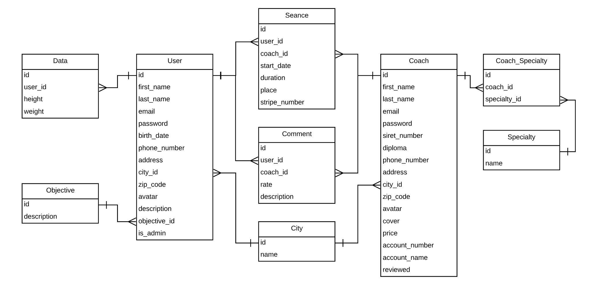

<h1>Coach Me 💻</h1>

Coach Me est une plateforme permettant à un utilisateur de réserver une séance avec un coach sportif de sa ville.

* Ruby version 2.5.1
* Rails version 5.2.3
* `bundle install`
* `rails db:create`
* `rails db:migrate`
* `rails db:seed`
* `rails server`
* en local : `http://localhost:3000/`
* en production : `https://coachme.herokuapp.com/`

<h2>Architecture</h2>

--------

Fait par Maja, Guillaume, Nicolas, Rémi et Ladislas 🤙 en utilisant les ressources de [The Hacking Project](https://www.thehackingproject.org)